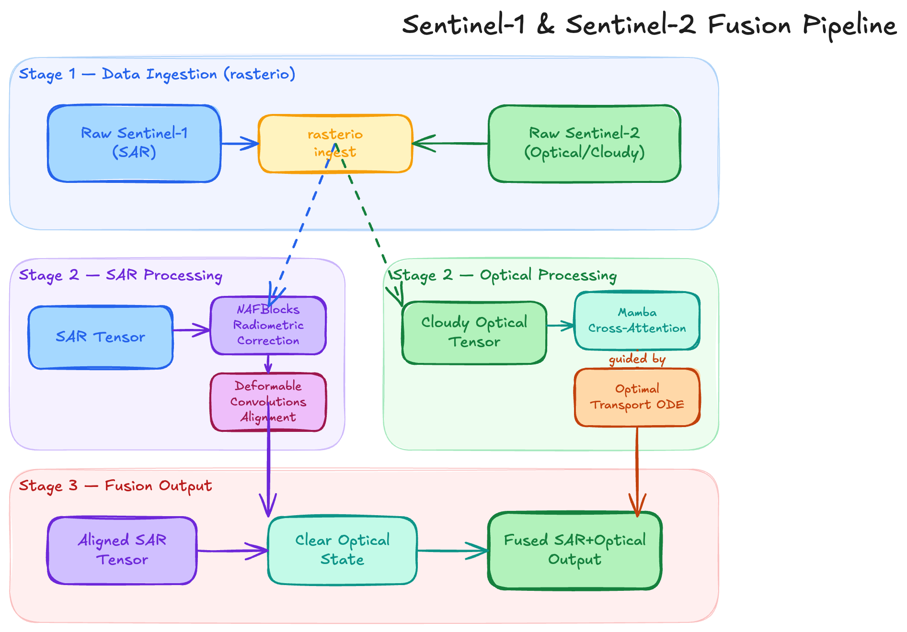

# SAR-Guided Optical Cloud Reconstruction via Latent Diffusion Bridge

A pipeline for reconstructing cloud-obscured Sentinel-2 imagery using
Sentinel-1 SAR guidance and an OT-driven latent diffusion bridge.

# Adaptive Mamba-Bridge (AMB) 🌍☁️

**Structure-Aware Diffusion with State Space Models for SAR-Guided Optical Cloud Reconstruction**

[](https://pytorch.org/)
[](https://opensource.org/licenses/MIT)

An advanced PyTorch framework for Earth Observation that reconstructs cloud-occluded satellite imagery. By utilizing an Optimal Transport Diffusion Bridge and a linear-time Vision Mamba backbone, AMB fuses Synthetic Aperture Radar (SAR) and Optical data to generate scientifically validated, cloud-free terrain while completely bypassing traditional Transformer memory bottlenecks.

## 🚀 Key Features & Novel Contributions

1. **$O(N)$ Linear-Time Backbone:** Replaces standard U-Nets and Vision Transformers with **Vision Mamba (Vim)**, allowing the processing of massive, continuous satellite swaths without GPU memory exhaustion.
2. **Sub-Second Inference:** Utilizes a **Diffusion Bridge (DB-CR)** continuous ODE to map trajectories directly from cloudy to clear states, bypassing the pure Gaussian noise phase and cutting sampling steps down to <10.
3. **Physics-Aware Radar Fusion:** Features a dedicated **NAFBlock + DCNv2** pre-processing stem to despeckle SAR data and geometrically align radar layover _before_ cross-attention fusion.
4. **Cloud-Aware Adaptive Loss:** Zeros out gradients in clear regions during training, forcing compute entirely onto occluded pixels and guaranteeing perfect background preservation.
5. **The "Frozen Judge" Validation:** Goes beyond perceptual metrics (FID) by incorporating a downstream Semantic Segmentation pipeline to prove the multi-spectral chemical accuracy of generated terrain.

---

## 🏗️ System Architecture



**Pipeline Flow:**

1. Raw Sentinel-1 (SAR) and Sentinel-2 (Optical) data ingested via `rasterio`.
2. SAR tensor is radiometrically corrected via NAFBlocks and aligned via Deformable Convolutions.
3. Cloudy Optical tensor is mapped to a clear state via the Optimal Transport ODE, guided structurally by the Mamba cross-attention modules.

---

## 🛠️ Installation

**1. Clone the repository:**

```bash
git clone [https://github.com/yourusername/Adaptive-Mamba-Bridge.git](https://github.com/yourusername/Adaptive-Mamba-Bridge.git)
cd Adaptive-Mamba-Bridge

data/
└── SEN12MS-CR/
    ├── train/
    │   ├── ROIs1158_spring_s1/       # SAR (Sentinel-1)
    │   ├── ROIs1158_spring_s2_cloudy/# Cloudy Optical (Sentinel-2)
    │   └── ROIs1158_spring_s2_clear/ # Clear Optical (Ground Truth)
    └── val/

---

## Architecture

```

Sentinel-1 (VV/VH) ──► SAREncoder ──────────────────────────────────────────────┐
│ cross-attn
Sentinel-2 cloudy ──► VQ-GAN Encoder (frozen) ──► z_0 │
│ │
Bridge forward ▼ │
q(z_t|z_0,z_1) z_t ──► U-Net ◄─── t-emb ◄──┘
│
ODE Sampler (1-5 NFE) ◄────┘
│
▼
VQ-GAN Decoder ──► Reconstructed clear image

````

**Key components:**
- **VQ-GAN** — encodes/decodes 13-band Sentinel-2 patches into a compact latent space
- **OT-Diffusion Bridge** — flow-matching between cloudy and clear latents with sine-based α schedule
- **U-Net backbone** — NAFBlocks + Bidirectional Mamba bottleneck + SAR Fusion Blocks (cross-attention)
- **Cloud-aware loss** — adaptive pixel weighting to prioritise cloud-region reconstruction

## Quick Start

```bash
# 1. Install dependencies
pip install -r requirements.txt

# 2. Download SEN12MS-CR dataset
bash scripts/download_data.sh --dest /data/SEN12MS-CR

# 3. Run full training pipeline
bash scripts/run_training.sh all

# Or run individual stages:
bash scripts/run_training.sh 1   # VQ-GAN only
bash scripts/run_training.sh 2   # Bridge only (requires VQ-GAN checkpoint)
bash scripts/run_training.sh 3   # Evaluation
````

## Configuration

All hyperparameters live in `configs/default.yaml` and dataset paths in `configs/paths.yaml`.
Override any value on the command line via Hydra syntax:

```bash
python train/train_bridge.py \
  training.batch_size=4 \
  diffusion.alpha_schedule_type=sine \
  diffusion.sampler_nfe=5
```

## Project Layout

```
configs/              Hydra config files
data/                 Dataset & preprocessing
models/
  vqgan/              Encoder + VQ bottleneck + Decoder
  bridge/             OT-ODE diffusion bridge, noise schedule, ODE sampler
  backbone/           NAFBlock, Vision Mamba SSM, SAR Fusion Block, U-Net
  cloud_aware_loss.py Adaptive multi-component loss
train/                Training & evaluation scripts
utils/                Metrics (PSNR, SSIM, MAE, SAM, LPIPS) + visualisation
scripts/              Shell scripts for data download and training
```

## Metrics

| Metric | Description                               |
| ------ | ----------------------------------------- |
| PSNR   | Peak Signal-to-Noise Ratio (dB)           |
| SSIM   | Structural Similarity Index               |
| MAE    | Mean Absolute Error                       |
| SAM    | Spectral Angle Mapper (degrees)           |
| LPIPS  | Learned Perceptual Image Patch Similarity |

Cloud-region variants (prefixed `cloud_`) evaluate only over masked pixels.

## References

- Ebel et al., _SEN12MS-CR: A Multi-Seasonal Dataset for Cloud Removal_, 2022
- Chen et al., _Simple Baselines for Image Restoration (NAFNet)_, ECCV 2022
- Zhu et al., _Vision Mamba: Efficient Visual Representation Learning_, arXiv 2401.13587
- Liu et al., _Flow Matching for Generative Modeling_, ICLR 2023
